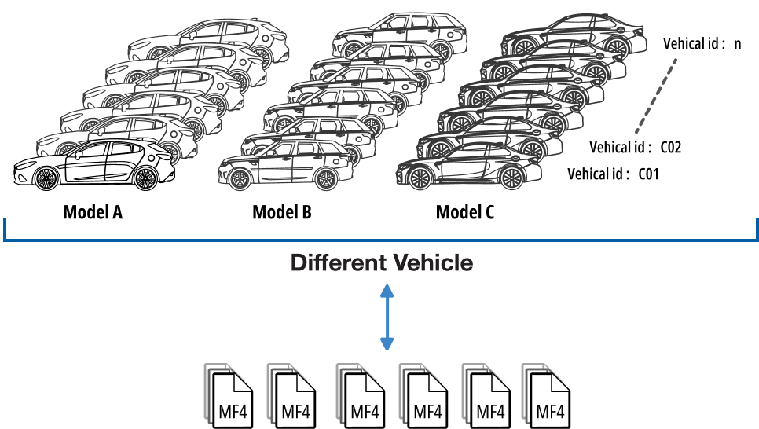
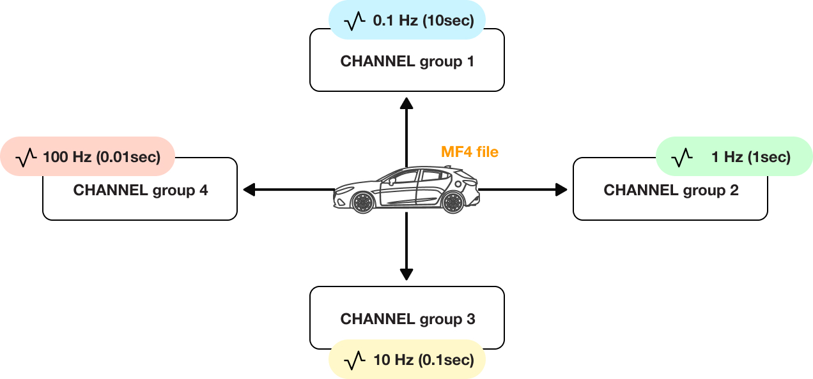

# Dataset Generator: Simulating High-Resolution Automotive unstructured Time-Series Data stored in MF4 files

Automotive systems generate vast volumes of high-resolution, unstructured time-series data stored in the mf4 format. Such data capture critical insights into vehicle performance, diagnostics, and operations. Transforming these raw data into structured formats requires robust data pipelines and scalable architectures.

This repository contains a script that generates dummy mf4 files mimicking high-resolution automotive measurement data. The data are generated at multiple sampling frequencies and include a variety of automotive signals (numeric and switch signals). These dummy files serve as a testbed for building data pipelines, warehouses, and advanced analytics solutions (such as Bigdata solution implementations).

### Vehicle data set Hierarchy



*Figure 1:* This diagram shows Data source and the folder structure:
- **Vehicle Models:** Folders such as VEH_MOD_A, VEH_MOD_B, and VEH_MOD_C.
- **Vehicle IDs:** Each model folder contains subfolders named with unique vehicle IDs (e.g., VEH_ID_A123456).
- **Files:** Each subfolder contains multiple mf4 files corresponding to that vehicle.

> **Note:** If the images are not visible in your Git repository viewer, please refer to the local `images` folder in the repository.

---

## What the Script Does

- **Signal Pool & Selection:**  
  The script defines a pool of unique signal names grouped by categories such as **Speed**, **Engine**, and **Temperature**. In addition, a set of switch signals (for on/off states) is defined. For each generated file, a random subset of signals (typically between 300 and 1200 channels) is selected. One file per vehicle uses all available unique signals. Four extra speed channels (`Speed_1`, `speed_001`, `speed`, `SPEED`) are always added in each file, in order to introduce data duplication and inconsistency, which must be addressed during data cleaning.

- **Data Generation:**  
  Numeric data is generated using random values (as float64, int64, or uint64) based on predefined ranges. Some numeric channels may be forced to "object" type (converted into fixed‑length byte strings "S32") to circumvent issues with unsupported Unicode data types. Switch data is generated as fixed-length byte strings ("S2") with values `b'ON'` or `b'OFF'`.

- **Multi-Frequency Support:**  
  Each signal is assigned a random sampling frequency from the list `[0.1, 1, 10, 100]` Hz. Channels with the same frequency are grouped together using a common time base, enabling the file to hold data at different temporal resolutions.

- **Folder and File Structure:**  
  The generated files are stored in a hierarchical structure:
  - **Base Folder:** `sample_data_set`
  - **Model Folders:** One for each vehicle model (e.g., `VEH_MOD_A`, `VEH_MOD_B`, `VEH_MOD_C`).
  - **Vehicle Subfolders:** Each model folder contains subfolders for unique vehicle IDs (formatted as `VEH_ID_A123456`).
  - **File Naming:** Files are named with the model, vehicle ID, and file index (e.g., `VEH_MOD_A_VEH_ID_A123456_file_1.mf4`).

### Raw Dummy Data Set Details

The raw dummy dataset is designed to resemble the unstructured time-series data produced in the automotive industry. Key points include:

- **Channel Count:**  
  Each file includes between 300 and 1200 randomly selected channels from the pool of over 1000 signals.

- **Multi-Frequency Sampling:**  
  The dataset contains signals sampled at multiple frequencies (0.1 Hz, 1 Hz, 10 Hz, and 100 Hz). This multi-frequency design reflects real-world data capture systems where some measurements are recorded at high frequencies (e.g., engine RPM) while others are recorded less frequently (e.g., ambient temperature).

  

  *Figure 2:* This diagram illustrates how channels within an mf4 file are grouped by sampling frequency. Channels with the same frequency share a common time base, ensuring that despite varying sampling rates (0.1, 1, 10, 100 Hz), the data remains synchronized.
  
> **Note:** If the images are not visible in your Git repository viewer, please refer to the local `images` folder in the repository.

- **Dataset Size:**  
  With the default parameters set as:
  - **Duration:** 600 seconds per file (10 minutes)
  - **Number of Files:** 12 files per vehicle
  - **Vehicle Models:** A, B, and C  
  the total generated dataset is approximately **11GB**. These parameters can be modified to suit your specific sample size and storage requirements.

---

## Setup and Usage

### Installation

- [Python 3.9](https://www.python.org/downloads/release/python-390/)
- [asammdf](https://pypi.org/project/asammdf/)

Install the dependencies via pip:
```bash
pip install asammdf
```

### Usage

1. **Generation Parameters and Expected Dataset Size**

The script is configured with the following parameters (which can be modified as needed):

- **Duration:** Each file contains 600 seconds (10 minutes) of data using duration = 600 
- **Number of Files:** 12 `.mf4` files are generated per vehicle using num_files = 12
- **Sampling Frequencies:** Channels are randomly assigned one of the following frequencies: `[0.1, 1, 10, 100]` Hz using possible_freq = [0.1, 1, 10, 100]
- **Vehicle Models:** Files are generated for vehicle models A, B, and C vehicle_models = ["A", "B", "C"]

Using these settings, the entire generated dataset is approximately **11GB**. You can adjust the duration, number of files, or frequency settings to generate a larger or smaller dataset as required.


2. **Run the Script:**

   Run the script to generate the MDF4 files:

   ```bash
   python generate_mf4_files.py
   ```

   This will create a folder named `sample_data_set` in your current directory, with a structure similar to:

   ```
   sample_data_set/
     VEH_MOD_A/
       VEH_ID_A123456/
         VEH_MOD_A_VEH_ID_A123456_file_1.mf4
         VEH_MOD_A_VEH_ID_A123456_file_2.mf4
         VEH_MOD_A_VEH_ID_A123456_file_3.mf4
     VEH_MOD_B/
       VEH_ID_B654321/
         VEH_MOD_B_VEH_ID_B654321_file_1.mf4
         ...
     VEH_MOD_C/
         ...
   ```

3. **Reading the Data:**

   You can read the generated MDF4 files using asammdf. For example:

   ```python
   from asammdf import MDF

   with MDF("sample_data_set/VEH_MOD_A/VEH_ID_A123456/VEH_MOD_A_VEH_ID_A123456_file_1.mf4") as mdf:
       df = mdf.to_dataframe(raster=1, use_display_names=True, time_as_date=True, only_basenames=True)
   ```

### Code Structure

- **Signal & Switch Definitions:**  
  - `signal_categories`: A dictionary grouping numeric signals by category.
  - `switch_signals`: A list of switch (on/off) signal names.
  - `default_properties`: Contains default properties (unit, min, max) for numeric signals. Temperature signals not found here use a fallback of ("°C", 20, 100).

- **Helper Functions:**  
  - `get_unique_signals()`: Extracts unique signal names and prints any duplicates.
  - `gen_num_data()`: Generates random numeric data given a range and data type.
  - `gen_switch_data()`: Generates b'ON' or b'OFF' data for switch signals.
  - `group_and_create_channels()`: Groups channels by sampling frequency and creates MDF Signal objects with a common time base.

- **Folder & File Generation:**  
  The script creates a structured output folder (`sample_data_set`) based on vehicle models (A, B, C) and generates a specified number of MDF4 files per vehicle. Each file name contains both the vehicle model and a unique vehicle ID.